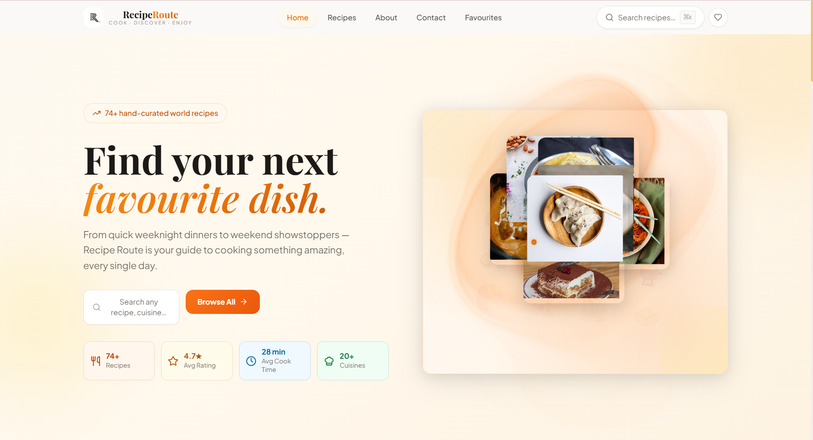

<div align="center">

<!-- ╔══════════════════════════════════════════════════════════════╗ -->
<!--                   ANIMATED WAVE HEADER                         -->
<!-- ╚══════════════════════════════════════════════════════════════╝ -->


<!-- ╔══════════════════════════════════════════════════════════════╗ -->
<!--                  ANIMATED TYPING TAGLINE                       -->
<!-- ╚══════════════════════════════════════════════════════════════╝ -->


<br/>

<!-- ╔══════════════════════════════════════════════════════════════╗ -->
<!--                      CTA BUTTONS                               -->
<!-- ╚══════════════════════════════════════════════════════════════╝ -->

[](https://recipe-route.netlify.app/)
[](https://aryan-sengar-portfolio-v2.netlify.app/)

<br/>

<!-- ╔══════════════════════════════════════════════════════════════╗ -->
<!--               ANIMATED SKILL / TECH ICON BADGES                -->
<!-- ╚══════════════════════════════════════════════════════════════╝ -->


<br/><br/>


</div>

<br/>

<!-- ━━━━━━━━━━━━━━━━━━━━━━━━━━━━ WAVE DIVIDER ━━━━━━━━━━━━━━━━━━━━━━━━━━━━ -->


<br/>

<!-- ╔══════════════════════════════════════════════════════════════╗ -->
<!--                      SITE PREVIEW                              -->
<!-- ╚══════════════════════════════════════════════════════════════╝ -->

<div align="center">

[](https://recipe-route.netlify.app/)

*Click the badge above to visit the live site ↑*

</div>

<br/>

<!-- ━━━━━━━━━━━━━━━━━━━━━━━━━━━━ WAVE DIVIDER ━━━━━━━━━━━━━━━━━━━━━━━━━━━━ -->


<br/>

<!-- ╔══════════════════════════════════════════════════════════════╗ -->
<!--                     ABOUT THE PROJECT                          -->
<!-- ╚══════════════════════════════════════════════════════════════╝ -->

## 🍴 About The Project

**Recipe Route** is a full-featured, production-quality recipe discovery web application built with **React**, **TypeScript**, and **Tailwind CSS** — developed as an internship assignment and extended well beyond the original brief.

It features **74+ hand-curated recipes** spanning **20+ world cuisines** — from Italian Carbonara and Hyderabadi Biryani to Japanese Ramen, French Crème Brûlée, and Peruvian Ceviche. Users can search, filter, save favourites, and follow interactive step-by-step cooking guides complete with a live countdown timer and ingredient checklist.

> 🧡 Built as both a professional internship deliverable and a personal challenge in design, animation, and scalable React architecture.

<br/>

<div align="center">

| 🎨 Design | ⚡ Animations | 🔍 Search & Filter | 🍳 Cooking Mode |
|:---:|:---:|:---:|:---:|
| Warm light theme, custom typography | WebGL & canvas-based ReactBits | Category, cuisine, difficulty, diet | Step navigator + live timer |

</div>

<br/>

<!-- ━━━━━━━━━━━━━━━━━━━━━━━━━━━━ WAVE DIVIDER ━━━━━━━━━━━━━━━━━━━━━━━━━━━━ -->


<br/>

<!-- ╔══════════════════════════════════════════════════════════════╗ -->
<!--                        FEATURES                                -->
<!-- ╚══════════════════════════════════════════════════════════════╝ -->

## ✨ Features

<br/>

| 🎨 UI & Design | ⚙️ Functionality | 📱 UX & Responsiveness |
|:---|:---|:---|
| Warm light theme — cream/stone/orange palette | 74+ recipes across 20+ world cuisines | Fully responsive — desktop, tablet, mobile |
| Custom RR double-R SVG logo with airplane detail | Advanced search: cuisine, category, difficulty, diet, cook time | Mobile auto-slideshow fallback for desktop animations |
| **Plus Jakarta Sans** + **Playfair Display** typography | Sort by popularity, rating, cook time, or calories | Smooth IntersectionObserver scroll-reveal effects |
| Glow cards with hover lift and orange shadow | Favourites system with localStorage persistence | Accessible keyboard navigation |
| Custom dot + ring cursor (Visily-style) | Step-by-step cooking mode with active step highlight | Print-friendly recipe layout |
| Glassmorphism & radial gradient accents | Live countdown timer — start, pause, reset | Touch-friendly mobile menu |
| SpotlightCard warm spotlight on featured recipes | Ingredient checklist with serving multiplier (½× → 3×) | Adaptive pagination on Browse page |
| StarBorder animated orbit on CTA buttons | Nutrition analytics bars per recipe | ⌘K keyboard shortcut for search |
| Strands WebGL waves on CTA banner | About Me page + Contact form (FormBold integration) | Scroll-to-top on page navigation |
| CircularGallery 3D scroll for category browsing | Embedded Google Maps in contact section | Fast Vite build — <170 kB gzipped |
| ImageTrail cursor trail in hero section | Chef's Tip collapsible per recipe | — |
| ClickSpark sparks on every button click | Related recipes at the bottom of detail page | — |

<br/>

### 📌 Pages & Sections

```
Home  ·  Browse (All Recipes)  ·  Recipe Detail  ·  About Me  ·  Contact  ·  Favourites
```

<br/>

<!-- ━━━━━━━━━━━━━━━━━━━━━━━━━━━━ WAVE DIVIDER ━━━━━━━━━━━━━━━━━━━━━━━━━━━━ -->


<br/>

<!-- ╔══════════════════════════════════════════════════════════════╗ -->
<!--                        TECH STACK                              -->
<!-- ╚══════════════════════════════════════════════════════════════╝ -->

## 🛠️ Tech Stack

<br/>

<div align="center">


<br/><br/>

| Layer | Technology | Purpose |
|:---:|:---|:---|
| ⚛️ **Framework** | [React 18](https://react.dev/) + [TypeScript 5](https://www.typescriptlang.org/) | Component architecture, type-safe development |
| 🎨 **Styling** | [Tailwind CSS v3](https://tailwindcss.com/) | Utility-first responsive design |
| ⚡ **Build Tool** | [Vite 5](https://vitejs.dev/) | Lightning-fast HMR and production bundling |
| 🎞️ **Animations** | [ReactBits](https://reactbits.dev/) — ImageTrail, Strands, CircularGallery, SpotlightCard, ClickSpark, StarBorder, SplashCursor | WebGL & canvas-based visual effects |
| 🌊 **3D/WebGL** | [OGL](https://github.com/oframe/ogl) (via ReactBits) | GPU-accelerated Strands and CircularGallery |
| 🔔 **Toasts** | [React Hot Toast](https://react-hot-toast.com/) | Non-intrusive notification system |
| 📬 **Contact Form** | [FormBold](https://formbold.com/) | Serverless form submission |
| 🗺️ **Maps** | [Google Maps Embed](https://developers.google.com/maps) | Location in contact section |
| 🔤 **Fonts** | [Google Fonts](https://fonts.google.com/) — Plus Jakarta Sans & Playfair Display | Premium brand typography |
| 🖼️ **Images** | [Unsplash](https://unsplash.com/) | High-quality recipe photography |
| 🚀 **Deployment** | [Netlify](https://www.netlify.com/) | Live hosting & continuous deployment |

</div>

<br/>

<!-- ━━━━━━━━━━━━━━━━━━━━━━━━━━━━ WAVE DIVIDER ━━━━━━━━━━━━━━━━━━━━━━━━━━━━ -->


<br/>

<!-- ╔══════════════════════════════════════════════════════════════╗ -->
<!--                     PROJECT STRUCTURE                          -->
<!-- ╚══════════════════════════════════════════════════════════════╝ -->

## 📁 Project Structure

```
recipe-route/
│
├── 📄 index.html                    ← Entry HTML + font & favicon links
├── 📦 package.json                  ← Dependencies & scripts
├── ⚙️  vite.config.ts               ← Vite configuration
├── 🎨 tailwind.config.js            ← Custom brand colors, fonts, shadows
│
├── 📂 public/
│   ├── 🖼️  logo.svg                 ← Custom RR double-R logo (SVG)
│   └── 👤 aryan.jpg                 ← Profile photo (About page)
│
└── 📂 src/
    ├── 🚀 main.tsx                  ← React entry point
    ├── 🧠 App.tsx                   ← Root — routing, cursor, state
    ├── 🎨 index.css                 ← Global styles, custom cursor, animations
    │
    ├── 📂 data/
    │   └── 📋 recipes.ts            ← 74+ recipes, types, category/cuisine lists
    │
    └── 📂 components/
        ├── 🧭 Navbar.tsx            ← Fixed header, mobile menu, logo
        ├── 🦶 Footer.tsx            ← Links, socials, copyright
        ├── 🏠 HomePage.tsx          ← Hero, categories, featured, CTA
        ├── 📖 BrowsePage.tsx        ← All recipes, filters, sort, pagination
        ├── 🍳 RecipeDetailPage.tsx  ← Full recipe, cooking mode, timer
        ├── ❤️  FavoritesPage.tsx    ← Saved recipes
        ├── 👤 AboutPage.tsx         ← Bio, skills, hobbies, links
        ├── 📬 ContactPage.tsx       ← Form, map, social links
        ├── 🃏 RecipeCard.tsx        ← Reusable card (sm/md/lg sizes)
        ├── 🔍 SearchModal.tsx       ← Full-featured search overlay
        │
        └── 📂 rb/                   ← ReactBits animation components
            ├── ClickSpark.jsx
            ├── SplashCursor.jsx
            ├── StarBorder.jsx
            ├── ImageTrail.jsx
            ├── Strands.jsx
            ├── CircularGallery.jsx
            ├── GooeyNav.jsx
            └── SpotlightCard.jsx
```

<br/>

<!-- ━━━━━━━━━━━━━━━━━━━━━━━━━━━━ WAVE DIVIDER ━━━━━━━━━━━━━━━━━━━━━━━━━━━━ -->


<br/>

<!-- ╔══════════════════════════════════════════════════════════════╗ -->
<!--                      GETTING STARTED                           -->
<!-- ╚══════════════════════════════════════════════════════════════╝ -->

## 🚀 Getting Started

**1. Clone the repository**

```bash
git clone https://github.com/aryansengar007/recipe-route.git
```

**2. Navigate into the project folder**

```bash
cd recipe-route
```

**3. Install dependencies**

```bash
npm install
```

**4. Start the development server**

```bash
npm run dev
```

**5. Build for production**

```bash
npm run build
```

> ✅ Runs on `http://localhost:4173` by default. Requires Node.js 18+.

<br/>

<!-- ━━━━━━━━━━━━━━━━━━━━━━━━━━━━ WAVE DIVIDER ━━━━━━━━━━━━━━━━━━━━━━━━━━━━ -->


<br/>

<!-- ╔══════════════════════════════════════════════════════════════╗ -->
<!--                   DESIGN CHALLENGES                            -->
<!-- ╚══════════════════════════════════════════════════════════════╝ -->

## 🧩 Design Challenges & What I Learned

This project pushed far beyond the original internship brief. Several visual and technical challenges took days to resolve:

| 🐛 Challenge | ✅ Resolution |
|:---|:---|
| GooeyNav black box bleeding outside the navbar | Overrode `.effect.filter::before` background to transparent — the SVG filter needs the element but not the visible fill |
| StarBorder dark inner content on a light theme | Rewrote the component CSS from scratch — `background: transparent; border: none` on `.inner-content` |
| Strands WebGL canvas not filling its container | Used `position: absolute; inset: 0` with explicit `width/height: 100%` via the style prop |
| ImageTrail items typed as `never[]` in strict TS | Added `as any` cast + global `.d.ts` module declarations for all JSX ReactBits files |
| SplashCursor `'use client'` directive breaking Vite | Stripped the Next.js directive with a sed command during build setup |
| Broken Unsplash recipe images across 10+ recipes | Audited all image IDs and replaced with verified working photo IDs |
| Light/dark text visibility switching themes | Defined CSS variables for all text/surface colors scoped to `html.light` and `html.dark` |
| Mobile: ImageTrail unusable without a mouse | Built a separate `MobileHeroSlides` component with `setInterval` auto-advancing at 2200ms |

> 💡 **Key takeaway:** Integrating third-party WebGL/canvas libraries into a React + TypeScript project requires deep understanding of CSS stacking contexts, component lifecycle, and type system boundaries.

<br/>

<!-- ━━━━━━━━━━━━━━━━━━━━━━━━━━━━ WAVE DIVIDER ━━━━━━━━━━━━━━━━━━━━━━━━━━━━ -->


<br/>

<!-- ╔══════════════════════════════════════════════════════════════╗ -->
<!--                    ACKNOWLEDGEMENTS                            -->
<!-- ╚══════════════════════════════════════════════════════════════╝ -->

## 🙌 Acknowledgements

- 🎞️ Animations by [ReactBits](https://reactbits.dev/) — ClickSpark, SplashCursor, StarBorder, ImageTrail, Strands, CircularGallery, SpotlightCard
- 🌊 WebGL rendering via [OGL](https://github.com/oframe/ogl)
- 🔔 Toasts by [React Hot Toast](https://react-hot-toast.com/)
- 🖼️ Recipe photography from [Unsplash](https://unsplash.com/)
- 🔤 Typography via [Google Fonts](https://fonts.google.com/) — Plus Jakarta Sans & Playfair Display
- 💡 UI inspiration from Visily.ai, Meraki UI, Tailblocks, and Mamba UI

<br/>

<!-- ╔══════════════════════════════════════════════════════════════╗ -->
<!--                     AUTHOR & CONNECT                           -->
<!-- ╚══════════════════════════════════════════════════════════════╝ -->

## 👨‍💻 Author

<div align="center">

### Aryan Sengar

🎓 **B.Tech CSE (AI & ML)** &nbsp;|&nbsp; 🌍 Gurugram, India &nbsp;|&nbsp; Frontend Developer & UI Enthusiast

<br/>

[](https://www.linkedin.com/in/aryan-sengar-786b96290/)
[](https://github.com/aryansengar007)
[](https://aryan-sengar-portfolio-v2.netlify.app/)
[](https://leetcode.com/u/aryan_sengar007/)

</div>

<br/>

<!-- ╔══════════════════════════════════════════════════════════════╗ -->
<!--                   ANIMATED WAVE FOOTER                         -->
<!-- ╚══════════════════════════════════════════════════════════════╝ -->


<div align="center">

© 2025 **Aryan Sengar** — All Rights Reserved. Unauthorized copying is strictly prohibited.

<br/>

*If you found this project helpful or inspiring, consider leaving a* ⭐ *— it means a lot!*

</div>
